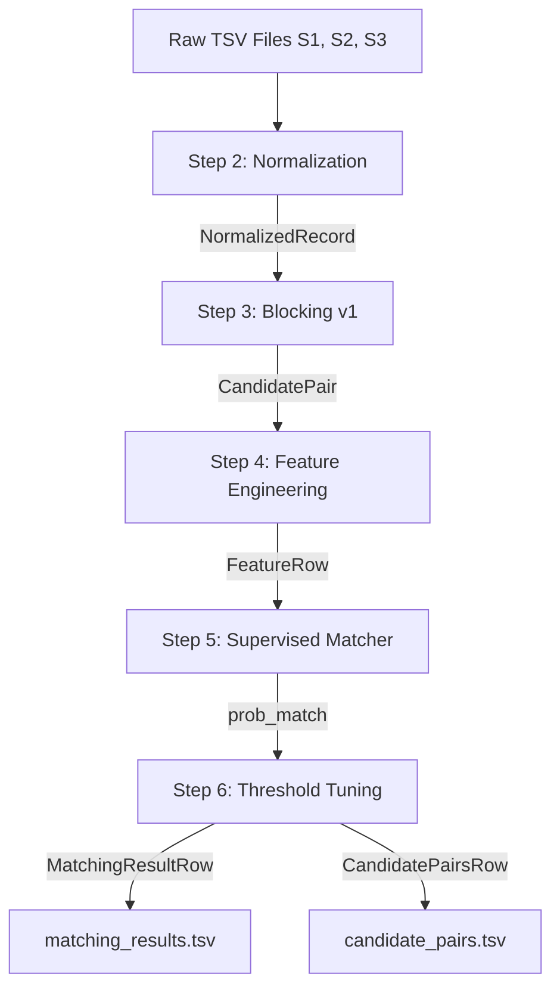

# Data Schemas & Inter-Module Contracts

This document specifies the **data contracts, schema definitions, and column specifications** for the WeFour Amazon ML Challenge Business Entity Resolution pipeline.

Because our workflow is modular (Text Normalization $\rightarrow$ Blocking $\rightarrow$ Feature Engineering $\rightarrow$ Modeling $\rightarrow$ Submission), every team member must adhere strictly to these column names and data types to prevent breaking downstream modules.

Python typed definitions (`dataclasses` and `TypedDicts`) are available in:
* [`code/business_entity_resolution/src/schemas.py`](file:///c:/Personal/Purvi_College/SEM-5/WeFour-Amazon-ML-Challenge/code/business_entity_resolution/src/schemas.py)
* [`src/schemas.py`](file:///c:/Personal/Purvi_College/SEM-5/WeFour-Amazon-ML-Challenge/src/schemas.py)

---

## 1. Pipeline Dependency Flow



---

## 2. Schema Specifications

### (A) Normalized Record (`NormalizedRecord`)
Produced by the **Text Normalization Engine** (`src/normalize.py`). Consumed by **Candidate Generation / Blocking** (`src/blocking.py`) and **Feature Engineering** (`src/features.py`).

| Column Name | Type | Nullable | Example | Description |
| :--- | :--- | :--- | :--- | :--- |
| `entity_id` | `str` | No | `"s1_10482"` | Unique identifier of the business entity. |
| `business_name` | `str` | No | `"Walmart Supercenter Inc."` | Raw name from source dataset. |
| `business_address` | `str` | Yes (empty string) | `"702 SW 8th St, Bentonville, AR 72716"` | Raw address string from source dataset. |
| `country` | `str` | No | `"US"` | Country code (e.g., `"US"`, `"India"`). |
| `normalized_name` | `str` | No | `"walmart supercenter incorporated"` | Accent-stripped, lowercased, punctuation-cleaned, legal suffix harmonized. |
| `normalized_address`| `str` | No | `"702 southwest 8th street bentonville ar 72716"` | Standardized abbreviations (`rd` $\rightarrow$ `road`, `st` $\rightarrow$ `street`). |

---

### (B) Candidate Pair (`CandidatePair`)
Produced by the **Blocking Stage** (`src/blocking.py`). Consumed by **Pairwise Feature Engineering** (`src/features.py`).

| Column Name | Type | Nullable | Example | Description |
| :--- | :--- | :--- | :--- | :--- |
| `source1_entity_id` | `str` | No | `"s1_10482"` | Source 1 reference entity ID. |
| `candidate_entity_id`| `str` | No | `"s2_49821"` | Candidate entity ID from Source 2 or Source 3. |
| `source` | `str` | No | `"S2"` | Origin source (`"S2"` or `"S3"`). |

---

### (C) Feature Row (`FeatureRow`)
Produced by **Feature Engineering** (`src/features.py`). Consumed by the **Matcher Model** (`src/model.py`).

| Column Name | Type | Range | Description |
| :--- | :--- | :--- | :--- |
| `source1_entity_id` | `str` | — | Reference S1 entity ID. |
| `candidate_entity_id`| `str` | — | Candidate S2/S3 entity ID. |
| **Name Features** | | | |
| `exact_name_match` | `float` | `0.0` or `1.0` | $1.0$ if normalized names are identical. |
| `name_token_jaccard` | `float` | `[0.0, 1.0]` | Word-token Jaccard similarity. |
| `name_3gram_similarity` | `float` | `[0.0, 1.0]` | Character 3-gram Dice coefficient. |
| `name_prefix_match` | `float` | `0.0` or `1.0` | $1.0$ if one name is a prefix of the other. |
| `name_len_diff_ratio`| `float` | `[0.0, 1.0]` | Relative character length difference. |
| `name_levenshtein_similarity` | `float` | `[0.0, 1.0]` | Normalized edit distance similarity. |
| `name_monge_elkan` | `float` | `[0.0, 1.0]` | Token-level Monge-Elkan similarity score. |
| **Address Features** | | | |
| `exact_address_match`| `float` | `0.0` or `1.0` | $1.0$ if normalized addresses match exactly. |
| `address_token_jaccard`| `float`| `[0.0, 1.0]` | Token Jaccard overlap on address words. |
| `address_3gram_similarity` | `float` | `[0.0, 1.0]` | Character 3-gram Dice similarity on addresses. |
| `address_missing` | `float` | `0.0` or `1.0` | $1.0$ if either S1 or candidate address is missing. |
| **Domain / Geographic** | | | |
| `country_match` | `float` | `0.0` or `1.0` | $1.0$ if countries match. |
| `numeric_overlap_count`| `float`| $\ge 0.0$ | Number of shared numeric tokens (street #, suite #). |
| `has_shared_pin` | `float` | `0.0` or `1.0` | $1.0$ if both share a 5-digit ZIP or 6-digit PIN code. |
| `pin_prefix_match` | `float` | `0.0` or `1.0` | $1.0$ if first 3 digits of postal code match. |
| **Target & Prediction** | | | |
| `label` | `int` (optional)| `0` or `1` | True Match flag from ground truth (for training). |
| `prob_match` | `float` (optional)| `[0.0, 1.0]` | Predicted probability of genuine match $P(\text{match})$. |

---

### (D) Final Submission Outputs

Both submission files must strictly follow formatting rules verified by [`utils/validate_submission.py`](file:///c:/Personal/Purvi_College/SEM-5/WeFour-Amazon-ML-Challenge/utils/validate_submission.py):
* **File format:** Tab-Separated Values (`.tsv`)
* **Delimiter:** `\t`
* **Singletons:** If an S1 entity has zero matches, its second column must be empty (empty string `""`, NOT `"None"` or `"nan"`).
* **Multi-matches:** Comma-separated without spaces (e.g. `"s2_101,s3_205"`).
* **Completeness:** Every S1 entity present in the test set must appear exactly once.

#### 1. `output/matching_results.tsv` (`MatchingResultRow`)
The official file evaluated on the competition leaderboard.

```tsv
source1_entity_id	matched_entity_ids
s1_001	s2_001
s1_002	s2_002,s3_104
s1_003	
s1_004	s3_001
```

#### 2. `output/candidate_pairs.tsv` (`CandidatePairsRow`)
The candidate pool produced by the blocking stage.

```tsv
source1_entity_id	candidate_entity_ids
s1_001	s2_001,s2_045
s1_002	s2_002,s3_104,s3_891
s1_003	s2_902
s1_004	s3_001,s2_312
```

---

## 3. Python Usage Example

```python
from code.business_entity_resolution.src.schemas import (
    NormalizedRecord,
    CandidatePair,
    FeatureRow,
    MatchingResultRow,
    MATCHING_RESULTS_HEADER,
)

# Creating a normalized record
record = NormalizedRecord(
    entity_id="s1_101",
    business_name="Walmart Inc.",
    business_address="702 SW 8th St, 72716",
    country="US",
    normalized_name="walmart incorporated",
    normalized_address="702 southwest 8th street 72716",
)

# Creating a feature row for model scoring
features = FeatureRow(
    source1_entity_id="s1_101",
    candidate_entity_id="s2_202",
    exact_name_match=1.0,
    name_token_jaccard=0.85,
    country_match=1.0,
    has_shared_pin=1.0,
)

# Creating a final prediction entry
result = MatchingResultRow(
    source1_entity_id="s1_101",
    matched_entity_ids="s2_202",
)
```
